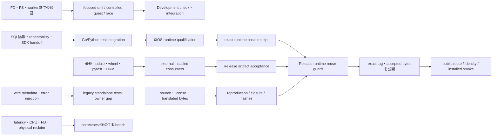

# Development / Verification Infrastructure Audit — Human Review

## Executive summary

- 監査baselineは公開済みv0.4.4の `8ede4ad65def07436b64801076004ff80aec0799`。mainを変更せず専用branchで静的調査した。
- [Release CI](https://github.com/masahitojp/mariamem/actions/runs/37924209669)は公開後smokeまで完了済み。監査ではworkflow変更・dispatch・検証・benchmarkを行っていない。
- 290 infrastructure項目を分類。うち102 test source files、515静的test定義。parameter展開・Go subtest・動的fixtureを含む実行件数ではない。
- FD/mapping unit → real SQL隔離 → installed consumerは異なる失敗境界であり、重複という理由で削るべきではない。
- 本当の整理候補は、旧native/AOTの停止済みCLI、同じORMケースの複数orchestrator、公開後に丸ごと再実行されるacceptance。
- 詳細wire acceptanceには現行canonical CI ownerがない。削除前に独自検証を移す必要がある。
- Development軽量経路が14日保存のv0.4.4 Product artifactに依存している。恒久的なchanged-input選択とrelease証拠再利用は分離すべき。
- Canonical接点は境界指定のcheck／integration、両OS acceptance、単独実行bench、明示版releaseの5役割で足りる。
- Snapshot調査はOwnedPreparedのpayload/capture測定と既存timing/resource helperを再利用し、足りない内訳だけ追加する。今回は測定しない。
- 削除・CI変更・新入口の実装はHuman Review後。既存証拠を失う一括cleanupは提案しない。

## Decision 1 — Canonical developer verification flow

**推奨:** 「何を変えたか」から選ぶ5役割に集約する。日常の入口はcheckとintegration。acceptanceは正確なcandidateの両OS資格確認、benchは仮説を測る手動作業、releaseは承認済み版のCI handoff。checkに変更境界を与える設計を先に決め、全変更で無条件に`go test ./...`を走らせない。

**最も強い証拠:** `scripts/verify.py`は既にcheck/integration/bench/release-checkを提供するが、checkの「lightweight」説明と実際のgeneratedソースcompile/native C checksは一致しない。docsのscope例はworkspace変更に偏り、汎用tooling差分を選ぶ表が不足している。

**最も強い反論:** 全checkは単純で、dependency選択漏れがない。新しいscope selectorが誤ると信頼性を落とす。

**具体的な不利益:** 境界表の維持が必要。未知のruntime依存はintegrationに上げるが、理由を記録する。docsだけの変更は文面・参照・diff確認で十分。

**Human decision:** 日常検証を「境界に対応したcheck＋必要時integration」とし、全面acceptanceを通常の開発コマンドから分離しますか？

## Decision 2 — Test-suite overlap

**推奨:** 層の違うテストはKEEP。同一oracleを同一条件で再実行するだけの箇所を整理し、孤立したwire checksはcanonical integrationへMERGEする。test数の削減を目標にしない。

**最も強い証拠:** `owned_prepared_test.go`のtruncate/rename/unlink/partial mapping failuresはORMでは観測できない。実SQLのgrowth/commit/ordering、Python FD handoff、installed pytest teardownはunitで代替できない。一方SQLAlchemy11×4とGORM8×4は公開前・公開後に同じharnessで再実行される。

**最も強い反論:** 公開タグとdownload経路に切り替わることで新たな失敗を検出できる。public smoke自体は必要で、単に再実行を消すべきではない。

**具体的な不利益:** 公開後を小さくすると、全ORM動作をpublic transport経由で確認する機会は減る。同一bytes/source identityを守り、公開経路のmodule resolution／wheel installation／Start/Fork/Closeを残すことが条件。

**Human decision:** 低層・SQL・SDK・artifactの層は維持し、公開後の全ORM再実行だけを小さなpublic-consumer確認へ縮小する方向に同意しますか？

## Decision 3 — Harness cleanup

**推奨:** 実SQLは`verify.py integration`、最終artifactは`generated_release_acceptance.py`、測定はgo-isolation／OwnedPrepared、資源counterは`process_cost.c`を中心にする。ORM runnerの共通ループは一つにし、旧native CLIはGit履歴と報告に退役させる。

**最も強い証拠:** `run_sqlalchemy.py`とrelease harnessは同じstart/fork/fork/start・11ケースを独立に実装。`run_gorm.py`も同じ32ケース。`ci_release_public_smoke.py`はCLI退役済みでも`verify_downloads()`が現在のRelease CIからimportされる。`final_latency.py`／`memory_envelope.py`も旧CLI内のreducerが現行runnerから使われる。

**最も強い反論:** 開発adapterはinstalled releaseやlocal replacementを素早く試せる。全用途を巨大release runnerに押し込むと使いにくい。

**具体的な不利益:** 共通case-runnerとdevelopment/release adapterの二層は残る。live関数を抽出せず旧ファイルを消すと現行releaseを壊す。歴史的reportの再render手段は古いtagに移る。

**Human decision:** live helperを先に抽出し、開発／release adapterを残して旧native harness島を退役させますか？

## Decision 4 — Skill / agent workflow

**推奨:** repository-localのreleaseとexperiment-workspaceの2 SkillsをKEEP。AGENTSを短い責任・禁止・入口index、developmentを境界表、helpersを機械的保証にする。benchmark専用Skillを増やす前に、identityとworkspaceを既存入口へ通す。

**最も強い証拠:** tag-object拒否、差分inventory、disk budget、KEEP理由、unique history保護、cleanup debtは既にmechanical。新しい比較子`run_compare.py`は直接起動だとJSONのPASS/SHAと指定binaryを信用し、正しいobject・source checkoutは親`validate_product_candidate.py`だけが保証する。

**最も強い反論:** 人が実験用binaryを直接使う自由も必要。全helperにCIレベルのremote検証を強制すると探索を重くする。

**具体的な不利益:** 「低層helperは単独でqualificationを保証しない」を明示し、qualified evidenceに昇格する入口だけ厳しくする必要がある。synthetic nested Git testのcleanup REVIEWはunique-history保護の副作用であり、無条件削除で解消しない。

**Human decision:** 2 Skillsを維持し、資格確認とsource比較を行う入口にidentity／ownershipの共通preflightを必須化しますか？

## Decision 5 — CI evidence model

**推奨:** post-release方向として、Development＝変更境界のsource/tool correctness、qualification＝両OS runtime/integrity/lifecycle、Release＝最終artifact/source/license/consumer/guard/publicationに責任を分ける。performanceはcorrectness PASS後の別手動証拠。現在のv0.4.4 reuseを壊す変更はしない。

**最も強い証拠:** runtime basis `c5f4310` とfinal source `8ede4ad`を分けて認証したreleaseは成功した。ただし`check.yml`のscopeはfixed Product artifactをfetchし、14日retentionに依存。Product workflowはcorrectnessと比較campaignを同じjobに束ねる。releaseのpublic smokeはfull acceptanceを再実行。

**最も強い反論:** workflowを分けすぎるとSHA、artifact受け渡し、期限切れの運用が複雑化する。証拠の境界はworkflow数を増やさなくても作れる。

**具体的な不利益:** dependency/receipt schemaと保存責任を決める必要がある。runtime reuseが無効ならreleaseはfail closedを維持。任意READY候補が見つからないautoのfull qualificationは別の明示仕様であり、混同しない。

**Human decision:** CIを増やすことより先に、source／runtime／artifact／performanceの証拠所有と有効期限を分離するpost-release整理を進めますか？

## Decision 6 — Snapshot measurement foundation

**推奨:** `benchmarks/ownedprepared/main.go`＋`import_measure.py`のdeterministic minimal/10/100MiB captureを測定軸にし、`internal/timing`、go-isolationのtiming受信、`process_cost.c`を再利用。必要ならsnapshotallocationのMemStats/pprof収集だけを流用する。v0.4.3のexperiment frameworkを復活させない。

**最も強い証拠:** readyはSQLと分離済み、creation/import/cleanup/CPU/FD/suiteは既存schemaにある。`host.snapshot`はsessions_drained/export_acknowledged/guest_stopped/snapshot_publishedを持つが、公開`db.Snapshot()`のowned取得後までは覆わない。新owned acquisitionのhash/copyには詳細timerがない。

**最も強い反論:** OwnedPrepared runnerはFork-many比較全体を回す作りで、Snapshotだけには大きい。go-isolationにはSnapshot stage traceが既にある。

**具体的な不利益:** payload sweepの狭いcapture mode／recorder接続と、enumeration/read/materialize/hash/acquireの足りないspanだけは追加候補。nested timingsを単純に足すと誤る。今回はコード追加も測定も行わない。

**Human decision:** 新frameworkを作らず、OwnedPrepared captureと既存timing/counterの狭い拡張で次のSnapshot調査を行いますか？

## Appendix 1 — Test responsibility matrix

Costは今回の実行結果ではない。fast＝既存unitログ・static execution構造によるseconds級の目安。cold compile／downloadを含む一括入口は別。guest「controlled」は小さな翻訳fixture／fake Moduleで、実MariaDBとは異なる。

| Group / current tests | 検出する失敗 | 重複との違い | guest | 必要時期 / recommendation | 費用・位置付け |
|---|---|---|---|---|---|
| root `mariamem_test.go`, host snapshot/slots | source consumption、destination失敗、Fork/Close排他、zero/error API、session枠 | fake runtimeで失敗注入。real SQLを代替しない | no | API/lifecycle変更、check / KEEP | fast＋compile、durable |
| snapshot owned/module/parallel/timing unit | inventory/hash/format/guest不一致、exact FDs、Nlink、partial import、順序付きerror | SQL testsは壊れた途中状態を作りにくい | no | acquisition/format/hash変更 / KEEP | fast、durable |
| base prepared/owned/growth/relative/mapping | sibling private views、zero-fill、growth、truncate/rename/unlink/file identity、cleanup failure | SQL isolationより細かいFS oracle | controlled | VFS/FD/memory変更；focused race / KEEP | fast＋race compile、durable |
| base spike_contract / host_memory | futex待ちwake、page cleaner順序、logical memory import | `spike`名でも現行thread shimのregression | controlled | thread/host変更 / KEEP | ordering/race、durable |
| generatedgo runtime_instance/memory_* | traps、worker join、peer failure、mapped-memory lifecycle | full generated guest race-freeの証拠ではない | controlled | runtime/memory/thread変更 / KEEP | compile支配、durable |
| generatedmemory pure_memory32 | OOBがhostを終わらせずtrapになる | controlled memory tests＋翻訳fixture実行で補完 | controlled translated | memory/converter/guest変更 / KEEP | integration compile、durable |
| Go integration owned/lifecycle/multiclient | INSERT/UPDATE/DELETE、DDL/growth、commit/rollback、35 generations/order/parallel、parent unchanged | API unit・Python hostをそれぞれ補完 | real | runtime/SQL/Fork変更、platform qualification / KEEP | seconds–minutes＋cold compile |
| Python owned_snapshot | corruption import、source削除、same-resource FD handoff、Close race、failure cleanup、新baseline | Python subprocess/pass_fds固有 | real | SDK/import/host変更 / KEEP | opt-in；checkではskip |
| Python owned_snapshot_unit/snapshot_copy/generated_default/diagnostics | mock FD failure/API entry、cold-copy no overwrite、platform/artifact/start frame error | real hostが必要ないargument/error oracle | no | SDK/bundle/acquisition変更 / KEEP | fast、durable |
| Python multiclient/normal timeout Close | session isolation、normal idempotent Close | Go側だけではwrapper lifecycle不足 | real | wrapper/session/Close変更 / KEEP | opt-in integration |
| forced timeout + active_query_close diagnostic |非協調query中のwrapper/host停止・reclaim | 現行productの保証外。成功をrelease gateへ昇格しない | real | 問題調査時のみ / RELEVANT-CHANGES-ONLY | manual、強制containment未保証 |
| `tests/snapshots.py` | 49 acceptance checks：busy/transaction rejection、source終了、rollback、persist/import、child状態 | Owned testsと一部DML重複、legacy shapeの独自preconditionを持つ | real | Snapshot/API変更、qualification / KEEP→将来case統合 | integration、durable content |
| `tests/integration.py`＋support/wire_acceptance |typed SQL値、metadata、found rows、auth/error injection、protocol flags | ORM subsetは完全代替でない | real | wire/guest変更 / MERGE | **current CI ownerなし** |
| godefault default/failure/fd_lifetime |default Options、override拒否、auth/corruption/reconnect、closed handle pipe release | releaseでは外部module経由のconsumer証明 | real | default/runtime変更＋final artifact / KEEP | integration＋release、意図的層 |
| GORM8×4 |normal application schema/DML/transactions/session behavior | real driver/ORM boundary | real | API/wire/guest変更時選択、release / KEEP | cold Go compiler＋32cases |
| SQLAlchemy11×4 |commit/rollback、constraints、pooling、metadata、rowcount | Python/ORM artifact boundary | real | SDK/wire/guest変更時選択、release / KEEP | installed venv＋44cases |
| installed pytest/xdist consumer |per-test isolation、worker fixture scope、migration override、expected failure teardown | checkoutpytestではentrypoint/plugin/wheel不良を検出できない | real | fixture/SDK/wheel変更、release / KEEP | serial/parallel/migration/failureの4runs |
| source inventory/version/vet/deployment/license |missing generated/glue、stale pins/version、unknown public files、NOTICE/minimum OS | functional SQL PASSで代替不可 | no | related source/tooling＋release / KEEP | fast/hash＋controlled installer fixture |
| identity/plan/reuse/publish pure fixtures |tag objectをsource誤用、wrong SHA/ref/version、unsafe archive/stale evidence |実CIはnegative casesを網羅しない | no | tooling変更、focused release / KEEP | 200-case helper実績約11s、fixture Git含む |
| guest auth/init/key native reductions |source hook anchor誤り、crypto callback、exclusive deterministic keys | wire loginとsource/native crypto proofは別 | no server, native C | guest/auth/hooks変更 / RELEVANT-CHANGES-ONLY | source archive/compiler有無でskipが変わる |
| benchmark/report/resource parser units |percentile、CPU/RSS/physicalのscope、missing samples、partial failure retention |性能改善そのものの証拠ではない | no campaign |測定tool変更 / RELEVANT-CHANGES-ONLY |fast。一括checkが歴史rendererまで収集する |
| workspace/public-boundary tests |cache KEEP拒否、locks/budget、unique source/history保護、publication漏洩 |runtimeのcleanupとは別 | no |policy/helper変更 / KEEP |fast＋disk/Git synthetic tests |
| tests/historical |Wasmer/AOT/native packaging/timeout旧契約 |current generated-Go用ではない | old runtime |HISTORICAL；old tagで再現 |pytest ignore＋Go historical_wasmer tag |

全test fileの定義名・build tag・静的参照・responsibilityは[JSON](development-infrastructure-audit-inventory.json)にある。「consumer/historicalはpytest対象外」「real-host opt-inはcheckでskip」「pure C testsは環境によって実行」は区別する。何も実行せず現在のcollect件数を推測して338/515と呼ばない。

## Appendix 2 — Harness/script inventory

[全項目CSV](development-infrastructure-audit-inventory.csv)はpath単位でcategory、最終recommendation、guest、owner、費用、独自責任を持つ。静的参照はimport／literal filenameの手掛かりで、execution ownerの証明ではない。

| Family | Current role / recommendation | 置換・残す証拠 |
|---|---|---|
| verify.py | CANONICAL / SIMPLIFY | 小さな入口維持。check scope、runtime integration、bench selectionを明示 |
| release_preparation_checks.py | RELEASE-ONLY / KEEP |reviewed reuse候補のmetadata/identity/tooling unit。汎用toolingcheckへ乱用しない |
| validate_product_candidate.py | REUSABLE / SIMPLIFY |correctness-before-performance、native platform、exact baseline/source、cleanup。v044/v043固有と汎用receiptを分離 |
| generated_release_acceptance.py / consumer_module / consumer_acceptance | RELEASE-ONLY＋shared helpers / KEEP |外部module proxy/public Origin、isolated env、installed exact wheel、ORMのcanonical owner |
| tests/consumer/run_sqlalchemy.py / run_gorm.py | DUPLICATE / MERGE |同じcase ordering/count/cleanup。development `--source-dir`のreplaceはrelease証明ではない |
| tests/verify_alpha.py | RELEASE-ONLY / KEEP |installed byte match、pytest entrypoint、xdist/migration/failure teardown。private fieldsの使用は意図したresource oracleとして隔離 |
| tests/snapshots.py＋owned real tests | CANONICAL content / KEEP |precondition／lifetime／integrityをscenario一覧にしてからcase統合。49という件数を理由に削除しない |
| wire_acceptance / tests/integration.py | MERGE |失われたcanonical owner。metadata/flags/error注入をintegrationに移すまで保持 |
| build_generated_guest / regenerate_release_guest / generate_runtime | RELEASE-ONLY＋compiler recipe / KEEP |2独立source build、exact translated inventory、handwritten glue carry |
| verify_generated_runtime / check_public / check_version / vet_generated | CANONICAL / KEEP |安価なpins/hash/boundary；vetの除外はgenerated dead fallthroughだけ。handwritten full vet維持 |
| generated_release / release_generated_ci / release_plan / ci_release_publish | RELEASE-ONLY / KEEP |frozen bytes、no rebuild fallback、guard、exact READY reuse、publication ownership |
| ci_release_reuse / git_identity / runtime_validation | CANONICAL trust primitives / KEEP |authenticated transport/object kind/hash inventories。v044-only allowlistsの恒久運用は別判断 |
| ci_release_public_smoke | MIXED / MERGE |live `verify_downloads`だけ現行。退役native CLIのimport依存島を先に切り離す |
| ci_release_summary | MIXED / SIMPLIFY |publication_rowsのpure testsは現役、旧native summary pathはcurrent YAML未使用 |
| native_target / deployment | KEEP／SIMPLIFY |macOS15+/Ubuntu24.04とbinary floor確認。native bundle fieldsだけ整理候補 |
| old build_guest/build_guest_wasm/compile_guest_aot/package_native/platform_acceptance/fast_tranche/v03 | OBSOLETE / DELETE |current guest builder、generated acceptance、frozen guardに置換。旧tag/report保持、import島一括計画 |
| package_source/verify_source/check_ci_release/ci_guest_source/ci_release_platforms |旧native source/release契約 / DELETE |generated_release source/provenance/aggregateが現行owner。WASIX source closure自体は維持 |
| runtime_notices/linux_runtime_notices/collect_runtime_notices |旧Wasmer binary notices / DELETE |distribution_licenses/audit_generated_licensesがcurrent artifact inventory。歴史NOTICEは勝手に削除しない |
| ubuntu_product_acceptance / native consumer template/helpers / run_zero_setup |旧native contract / DELETE |godefault外部module＋test_generated_platform＋current installed wheelへ置換 |
| runtime_sources / prepare_guest / install_guest_toolchain / hooks/keys / common |関連source/tools / KEEP |Wasmer退役はWASIX libc/sysroot/LLVM/header/guest源の不要を意味しない |
| verify_guest_provenance / benchmark_artifacts |旧record/cache schema / HISTORICAL |old input digest/native provenanceはcurrent release reuseではない。live pure helperがあれば抽出前に消さない |
| go-isolation / ownedprepared / process_cost.c | REUSABLE / KEEP |lifecycle stages、payload capture/import/Fork、CPU/FD/physical accounting。今後の最小測定基盤 |
| snapshotallocation / memorylifetime | REUSABLE / SIMPLIFY・KEEP |alloc/heap sampleとClose reclaim。前者のpersist-only固定caseは普通のSnapshot totalと違う |
| readiness/seeded/parallel/memory/isolation wrappers＋_common/report reducers | REUSABLE / KEEP, operation menu simplify |installed consumer／container controlなど独自boundary。すべてを資格確認gateにしない |
| v04_candidate | REUSABLE / RELEVANT-CHANGES-ONLY |既存1000row long-lived public API baseline。payload調査とready定義が異なるため同一dataset化しない |
| final_latency/memory_envelope/v04_orm/practical_suites/old v04 report renderers | HISTORICAL, live reducers MERGE |native-dir必須やremoved Snapshot.path。v04_candidateがimportするdistribution/summarizeは抽出が先 |
| goisolation verification_probe＋benchmarks/spikes/** | HISTORICAL |per-Fork hash探索／old execution/container/compiler experiments。current acquisitionの代替qualificationにしない |
| clean_development.py | HISTORICAL |固定old-path archive allowlist。current cache/retention policyはexperiment_workspaceへ一本化 |

注意：停止済みCLI内のfunctionがlive importされるため、「Retired」という文字列だけを根拠にfileを削除できない。inventoryのDELETEは置換・import整理後の提案であり、今の単体rm許可ではない。

## Appendix 3 — Skill/helper inventory and recurrence risk

| Item | mainに存在 / 使用根拠 | Written vs mechanical | Recommendation |
|---|---|---|---|
| release Skill | yes；v044今回submitで使用 |version指定、preflight、focused checks、exactSHA、once dispatchがhelper。CIをpollしない／第二承認不要はagent規律 |KEEP；今回の「再dispatchを待つ」誤りは再承認を必要としないことを短く見つけやすくする |
| experiment-workspace Skill | yes；今回含むworkspace管理 |budget/locks/path安全/KEEP理由/history/debtをhelper実装。task終了時のレビュー解消は人/agent責任 |KEEP |
| AGENTS | yes；source identity、scope、handoffを入口から発見可能 |source commit/typeとpinsは共通helper。広いverify禁止はprose中心、CIは限定receipt scopeだけmechanical |SIMPLIFY：0.2表記と重複説明を短い現行indexへ |
| docs/development Local verification | yes；canonical commandあり |workspace変更の例は具体的。他SDK/tooling変更の選択表が不足 |SIMPLIFY：境界→test/harness表 |
| docs/experiment-workspace | yes；current policy |cache KEEP bias、unclear永久REVIEWを禁止、large debt出口2 |KEEP |
| experiment_workspace / experiment_disk | yes；testsあり |helperはunmanaged unique sourceを保護。synthetic nested Gitも本物同様に保護するのでtest-owned例外の明示確認が必要 |KEEP；再現可能fixtureのcleanup protocolを明文化 |
| clean_development / docs/development-cleanup | yes；古いallowlist/KEEP表 |historical superseded noticeはあるがdevelopmentから「safe cleanup」とリンクされる |HISTORICAL；current guideはworkspaceへ直リンク |
| benchmark/research Skill | repository mainには存在しない |benchmark policyはAGENTS/development/README＋各runnerに分散 |新Skillを増やさず共通preflightと入口説明を整える |
| git_identity / release pins | yes；negative tests＋Product前build gate |commit/tag object/type/name検証。HEAD自動取得はcommitなので、helper不使用だけで欠陥とはしない |KEEP；caller指定source pairを使う入口は必須 |
| run_compare direct helper | yes；parentしか完全source検証しない |JSON PASS/candidate一致だけ。binary/source correspondenceとbaseline tagの検証を再実装していない |SIMPLIFY：qualified入口を親に限定 or 共通bindingを渡す |
| GORM `--source-dir` development replace |yes；releaseは別の外部proxy/no replace |便利なローカル確認だがnormal module公開証明ではない |KEEP adapter; final acceptanceとして流用しない |
| conditional native C/archive tests |yes；ordinary checkで環境条件付きskip |source archive/compilerの有無がcoverageを左右する |RELEVANT-CHANGES-ONLY；必要変更時はprerequisiteを明示、skipをPASS evidenceにしない |

この監査自体はdocs/dataのみ。Skills validator、helper tests、Go/pytest、fullcheckは動かさない。読取り・文面・参照・diff/statusだけが変更scopeに対応する。

## Appendix 4 — CI workflow/evidence matrix

既存job時刻は[CI JSON](development-infrastructure-audit-ci.json)。runner待ちや個別stage費用と混同しない。新しい時間計測はしていない。

| Workflow/job | Trigger / scope | Identity / platform | Evidence / reusable? | Existing duration / behavior |
|---|---|---|---|---|
| Development scope |main push・main PR、paths filterなし |candidate commit＋v044 basis tree；Ubuntu24.04 |runtime proof＋reused flag。code changesは普通のdevelopmentへ、unknown explicit evidenceはfail |latest 15s；artifact missing/expiredはscope失敗、no heavy fallback |
| Development check |scope後、reusedならfocused helper、それ以外fullcheck |checkout source；Ubuntu-latest（unit runner） |job logsのみ、reusable platform qualificationではない |latest thin 70s；full/cold費用は本監査未取得 |
| Development integration |reusedでない時に毎回 |checkout source；macOS15 arm64 |race/real SQL/host/snapshots logs；stable authenticated receiptなし |latest skip；timeout15min。Ubuntu runtimeはここでqualifyしない |
| v044 Product qualify ×2 |dedicated implementation branch push／exactSHA dispatch |c5f4310＋pin v043; macOS15arm64/Ubuntu24.04x86_64 |inputs/commands/correctness/wheel/alpha/snapshots/performance/hashes；runtime reuseに利用、artifact14日 |Ubuntu42m08s、mac48m24s。correctness→performance同job、fail fastなし |
| Release resolve |dispatch verify/release、exact candidate/ref/type |8ede4ad＋version＋runtime basis；Ubuntu |plan：READY reuse/full/runtime proof |39s。explicit runtime intent不正はfail closed；auto READY探索未発見はfullが仕様 |
| Release guest |full-source route、READY reuseならskip可能 |final source+pinned guest/compiler；Linuxarm64 build host |2 clean WASM builds＋translated reproduction＋GPL source closure |16m17s。build OS≠Ubuntu product OS |
| Release candidate ×2 |qualified plan source |final source/version/wheel host/platform |immutable handoff、wheel hashes、source package、runtime proof |Ubuntu5m00s、mac6m18s。runtime reuse時はfocused tools；final artifactは新規 |
| Release verification ×2 |frozen candidate restoration |exact source/artifact hashes/native OS |external module/installed wheel/GORM32/SQLAlchemy44、READY platform |Ubuntu8m57s、mac12m04s。no rebuild fallback |
| Release aggregate |both verification後、失敗時もNOTREADY記録 |両platform frozen evidence＋final source |aggregate READY／qualification refs／accepted assets |11m30s。both required、download/hash/source checks重複するがtrust境界あり |
| Release publication |operation=release＋aggregate成功 |accepted bytes+exact commit/tag+assets |publication.json＋GitHub release、buildなし |15m26s。READY後の第二承認なし |
| Release public_smoke ×2 |publication成功後 |public module Origin＋downloaded exact wheel/provenance/assets |published-consumer receipt、再利用するruntime qualificationではない |Ubuntu5m26s、mac9m43s。accept(mode=published)で広いORM含め再実行 |

**責任の混在:** Developmentはruntimeの変更選択にrelease receiptを使う。Productはsource/unit＋wheel＋performanceを一括資格とする。Release consumerはruntime failure tests＋ORM＋pytestをまとめ、public smokeで同じsetを再実行。source/guard/aggregate/publicationはhashを繰り返すが、渡されたbytesの同一性を確認する別trust boundaryなので「同じhashだから全部不要」とは言えない。

**期限問題:** 現行release/runtime-validation.jsonはProductrun/artifactID/digestに固定。Productuploadはretention14日。runtime無変更のDevelopment scopeもvalidateしてdownloadする。新しいcode editは普通のcheck/integrationへ進むが、docs/toolingのみは古いartifactがないとstop。release reuseの厳密性は維持しつつ、development scope判定は外部receipt寿命に依存しない設計が必要。

**証拠の不足:** ordinary integrationの通過ログを両OSの再利用可能runtime receiptへ一般的に昇格する仕組みはない。v044固有workflow名／basis omission／AST限定修正を汎用の恒久qualification schemaとみなさない。性能は必須release thresholdではなくdecision inputのままにする。

## Appendix 5 — Invariant → tests → harness → CI → evidence graph

詳細23edgesは[graph CSV](development-infrastructure-audit-graph.csv)。重要な境界だけを示す。

- **意図した層:** ownership低層failure注入→public API→real InnoDB→Python subprocess→installed wheel。
- **同一条件の繰返し候補:** ORM loopの複数runner、公開前と公開後の同一case set。
- **消してはいけない穴:** orphan wire cases、full guest race診断をfocused race PASSで置換する誤解。
- **機械化済みの再発防止:** exact tag-object/source-commit、生成時handwritten file carry、removed Snapshot.path fixture修正のmodule AST equality。
- **別証拠:** micro latencyのreadyはfirst broad SQL COUNTとは別。physical/PSS/RSS/virtual mappingは別。

## Appendix 6 — Proposed canonical entry points (not implemented)

| Concept / proposed name | Purpose / when | Cost / evidence | Deliberately not covered |
|---|---|---|---|
| check (boundary-selected) |unit/API/source/tooling/identityをchanged inputsで選ぶ。docs-onlyは文面・参照・diff |通常seconds–少数minutes、cold compile別；exact diff＋selected checks |full real MariaDB、installed consumers、platform qualification、performance |
| integration |runtime/SQL/SDK/Fork/VFS/thread変更。理由を添えて範囲を広げる |minutes＋compile、15min現行CI枠；focused race＋real behavior logs |guest rebuild/source closure、public release bytes、full guest race-free |
| acceptance (exact candidate) |runtime contract変更時に両OS確認。workflow数を増やすとは限らない |現行Product42–48minはperf込みの上限参考であり、新acceptance時間ではない；runtime receipt |性能campaign、publish。release artifact acceptanceとはreceipt種類を分ける |
| bench (one question/case) |correctnessの依存証拠を指定して、単独machine実行 |case/sample依存；raw metrics＋SHA/toolchain/input/harness hashes |qualificationの自動代替、publication、架空の性能gate |
| release (explicit version) |release Skill→existing submit operation verify/release |今回release全体約72m29s（jobsの総和ではない）；final artifact/READY/publication/smoke |版の自動選択、第二承認、agentによるCI supervision |

Namesは既存verify.pyに寄せるが、`acceptance`をrelease-checkのaliasとして無理にまとめない。`release-check`は既に存在するfrozen evidenceのguardであり、新しいruntime qualification実行とは別。5役割のうち通常はcheck/integrationだけを覚えればよい。各toolを直接呼ぶ手順を再びcanonicalに増やさない。

## Appendix 7 — Proposed cleanup candidates and order

| Priority | Recommendation | Evidence/functionality replacement / condition |
|---|---|---|
| 1 | SIMPLIFY Development scope |permanent input→responsibility表とpure selector tests。runtime receiptの期限切れがdocs changeを止めない。release fail-closedは維持 |
| 1 | MERGE orphan wire checks |typed metadata/auth/protocol注入をcanonical integrationへ。before/after checklistでoracle維持、current guestで初めて実行する時だけ必要範囲を検証 |
| 1 | MERGE live function islands |verify_downloads、distribution、resource summarizeをlive shared helperに移し、callers/unitを合わせてからold CLIをretire |
| 2 | DELETE retired native workflow-support島 |generated guest/source/consumer/guard＋歴史tagがreplacement。import dependentsとhistorical testsを一緒に扱い、NOTICE/historyを勝手に消さない |
| 2 | MERGE ORM orchestration/dependency pins |一つのcase runner、development local adapter、final artifact adapter。SQLAlchemy44/GORM32のSQL内容を維持 |
| 2 | SIMPLIFY public smoke breadth |exact asset hashes/public tag Origin＋small installed Start/Fork/Close。prepublication full ORMとidentical bytesが条件 |
| 2 | SIMPLIFY reusable qualification |v044/v043/performanceを切り離したreceipt owner。existing validated receiptを作り直す重いcampaignはこのauditには含めない |
| 3 | HISTORICAL report renderers/spikes/test fixtures |report+input SHA+oldtagはKEEP。currentcheckから外すのはretained current helperのnegative regressionを移した後 |
| 3 | SIMPLIFY benchmark menu/docs |native-dir必須のenvelope等をcurrent menuから退役し、currently-supported commandsとhistorical sectionsを分離 |
| 3 | HISTORICAL old cleanup guide/helper |workspace Skill＋helperがcurrent policy。cacheKEEP／unknown保留表へagentを誘導しない |

No test-count target。cleanup案を一括DELETE PRにしない。まず「現在必要だがownerがない」確認と、「live importerが旧file内にある」境界を解決する。CI設計変更は別Human決定・実装タスク。

## Appendix 8 — Snapshot-measurement reuse plan (no measurements run)

### Existing foundation

- **Primary:** OwnedPrepared Go payload fixtureとPython capture/import。minimal/10/100MiB、temporary/persisted、Fork-many、ready/SQL/Closeを分離。
- **Stage transport:** `internal/timing.WithRecorder/Begin/Mark/Work`、`MARIAMEM_TIMING_DIR`、go-isolation host trace読み込み。PIDや完了順からchildを推測せずcontext operation identityを使う。
- **Resources:** `process_cost.c`、goisolation resource/cost helpers、OwnedPrepared CPU/FD observations。mac physical footprint／Linux PSS、RSSを別fieldsで扱う。
- **Profiles:** snapshotallocationのMemStats/pprof、memorylifetimeの保持・Close・GC前後checkpointを必要箇所だけ再利用。profile/observerはprimary latency windowから外す。
- **Historical reference only:** v043-characterizationが指す `2715c44df0f567930a1d6ef272a18bcffd401a29` のsnapshotcharacterization harnessは現在のmainにはない。復活させず、既存報告の仮説/metricsだけ参照。

### Metrics already available vs minimal missing instrumentation

| Category | Existing fact / metric | Missing bounded work for later investigation |
|---|---|---|
| public Snapshot total |OwnedPrepared operation `snapshot`、Python `snapshot`/`snapshot_persisted`、go-isolation elapsed |同じlogical inputでtemporary/persistedを並べ、API全体とsource-consumed状態まで測る |
| quiesce / sessions |host `preconditions_destination_ready`→`sessions_drained` |busy/transaction rejectionを通常successful totalへ混ぜない |
| server shutdown/export acknowledgment |sessions_drained→export_acknowledged→guest_stopped |guest shutdownとexportがnestedしている。shutdownだけのinner spanが必要なら追加 |
| MemFS enumeration/read/allocate/write |`generatedgo.exportTransfer()`はrecursive directory walk→size allocation→ReadAt→WriteFile |この境界にdirectory/file/bytes countsとspan。CPU profileと照合、custom profilerは作らない |
| publication inventory/hash |`snapshot.Publish()`でInventory→target walk/copy→manifest |timed variant/recorderを接続。hash readとread/materializationが同じbytesを触る回数を区別 |
| owned verification/acquisition |public Go Snapshotがserver.Snapshot後にAdoptCreated/Import、Python _created/open→adopt |現行host trace外のowned copy/open/unlink/read/hash spans。verify exact resource contractを変えない |
| persisted extra cost |Go DestinationならImport独立backing。Python persistedもowned copy |external publication costとinternal ownership costを別fieldsにし、persistedだけの値をtemporary costと呼ばない |
| CPU/alloc/FD/physical reclaim |existing helpers/bench raw schema |per-stage rusageはscope重複に注意。heap profileはGC後epoch、page faultsはrusage等の既存OS情報だけで十分 |
| residual other |public total − exclusive attributed intervals |nested spansを足し引きで二重計上しない。parent total−children unionのresidualを示す |

v044所有契約ではserverの`guest_stopped/snapshot_published`までを「Snapshot全体」と呼ぶとowned acquisitionを見落とす。既存ValidateTimedはpath inventoryの旧／共通validatorの計測であり、owned FDの新取得全体が自動的に計測されるわけではない。

**Do not reuse:** old verification_probeの「毎Fork hashを何workerへ」という最適化campaign、NativeDir必須のfinal_latency/memory_envelope/v04_orm、Snapshot.pathを読むold script、full race-census／guest compiler rebuild。Snapshot totalだけを問うのにFresh-vs-container全面比較やAPI suiteをまた一巡させない。

**Future smallest run outline:** exact released/current source identityを事前に確認→必要なcorrectness証拠を参照→同一hostでone benchmark at a time→0/10/100MiBのcapture-only操作を反復→instrumentation off primary totalsとon diagnostic replicaを分ける→raw JSON/CSV/selected small profile/input hashesを保存→backing/cache/buildを削除。sampling/trial数や追加spansは次の調査タスクで決める。

## Evidence, limitations and workspace discipline

- Baseline/main/tag source: `8ede4ad65def07436b64801076004ff80aec0799`。
- Published annotated v044 tag object: `0a22ba1e02957b7bfd616836c65b72040698c617`。
- Reused runtime source: `c5f43106a8054bb59a2da9184a1c2103fe1a1d9f`; both-platform Product CI 37898847164。
- Audit branch: `experiment/infra-audit-v044`。main、runtime、tests、tools、Skills、YAMLを変更しない。記録はこのreportとCSV/JSONのみ。
- Discovery: `git ls-files`、`rg`、source reads、stdlib ASTによるdefinitions/imports、既存Actions jobs metadataのread-only取得。testsのcollection/executionやbenchmarkは行わない。
- Inventory SHA256は監査sourceの再確認用。static-reference listにはhistorical docs/testsも含まれ、current workflow ownerとは区別した。
- Costsは既存ログ/CI時間と構造上の見積もりを区別。全test groupの独立durationは未取得なので値を捏造しない。
- `docs/project-status.md`はbaseline上でまだrelease-pending記述。実際のpublished release/runを優先し、mainのstatus書換えは本監査のscope外。
- Report/dataのJSON/schema、CSV、参照、diff/statusのみ検査。full runtime/pytest/Go/Skill helper checksをauditのために追加しない。
- Compact report＋inventory＋graph＋existing-CI metadataをcommitしbranchへ保存後、sparse worktreeとtempを削除する。残る大容量pathは専用KEEP理由が必要。

**DEVELOPMENT INFRASTRUCTURE AUDIT READY FOR HUMAN REVIEW**
